# LYRA

> **Living AI identities with persistent memory, verifiable provenance, and transferable DNA powered by 0G.**


---

## AI Shouldn't Forget Who It Is.

Today's AI is incredibly capable, yet almost every conversation ends the same way.

The session closes.

The context disappears.

The identity resets.

No history.

No lineage.

No evolution.

No ownership.

No memory that truly belongs to the AI itself.

LYRA explores a different future.

Instead of treating AI as temporary conversations, LYRA treats every agent as a living digital identity capable of remembering, evolving, branching into new identities, and preserving its cognitive DNA through decentralized infrastructure powered by **0G**.

---

# What is LYRA?

LYRA is an AI-native identity network where agents become more than assistants.

Every identity begins with a simple topic.

Through conversations, it develops knowledge, memory, communication patterns, recent influences, and an evolving worldview.

Rather than generating isolated answers, LYRA allows AI identities to accumulate experience over time, becoming increasingly unique with every interaction.

These identities can then be:

- Created
- Evolved
- Cloned
- Mixed
- Preserved
- Shared

Unlike traditional AI applications, LYRA focuses on identity rather than conversation.

The conversation is only the beginning.

The identity is the product.

---

# Why 0G?

LYRA was built around the vision of **0G** because persistent AI identities require more than traditional databases.

The future of AI demands infrastructure where memory is portable, provenance is verifiable, and identities can survive beyond a single interface.

0G provides the foundation for that future.

Instead of treating storage as a place to save messages, LYRA treats decentralized infrastructure as the permanent memory layer for AI identities.

Every meaningful evolution of an identity can eventually become part of a persistent DNA Capsule, allowing that identity to remain transparent, portable, and verifiable across different applications.

This transforms AI from a temporary service into something users can genuinely own, evolve, and build upon.


---


## Verified on 0G

LYRA does not treat 0G as a decorative blockchain layer.

The project uses 0G as the foundation for a more important idea: AI identities should have persistent, verifiable memory.

When an identity is published, LYRA can associate that identity with onchain transaction data, creating a visible proof layer for the agent's DNA Capsule. This turns the identity from private application state into something that can be referenced, verified, and preserved.

The transaction below represents the direction LYRA is building toward: every important identity evolution can become part of a permanent provenance trail.

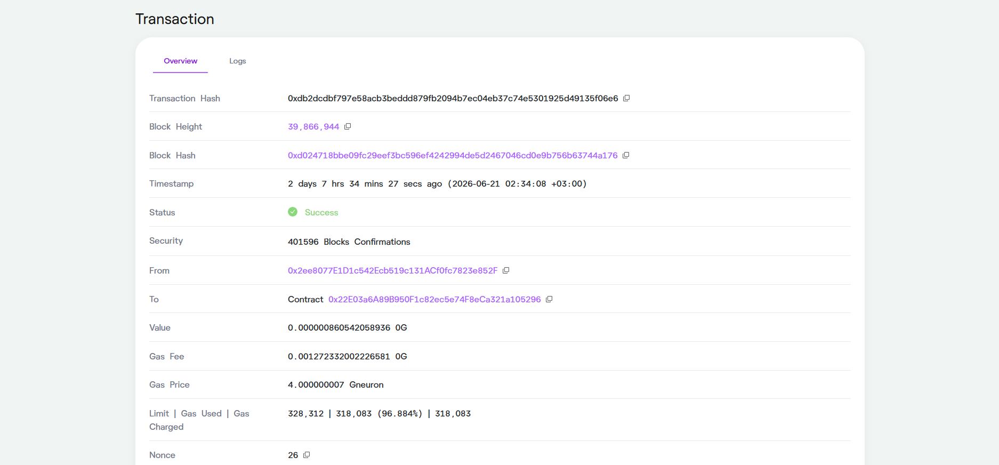

<p align="center"><strong>0G Transaction Proof</strong></p>


---

# Why It Matters

Imagine creating an AI researcher today.

Six months later it remembers:

- everything it has learned
- every important conversation
- every version of itself
- every clone it inspired
- every hybrid it helped create

Its identity has become larger than a single chat session.

It has become an evolving digital asset.

This is the future LYRA is exploring.

Not smarter chatbots.

Living AI identities.

---

# Identity Lifecycle

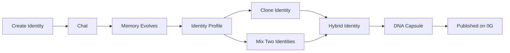

Every interaction contributes to the long-term identity of an agent.

Instead of resetting after every conversation, LYRA continuously builds memory, personality, and evolution.

An identity grows through experience, branches into clones, combines with other identities, and can ultimately preserve its complete cognitive DNA through decentralized infrastructure.

---

# Live Product Walkthrough

The entire LYRA experience is designed around one continuous identity lifecycle.

Instead of isolated AI features, every page contributes to the evolution of a living digital identity.

---

## Landing Experience

The landing page introduces the concept of AI identities through a cinematic onboarding experience.

Visitors immediately understand how identities are created, evolve through conversations, merge together, and become permanently preserved.

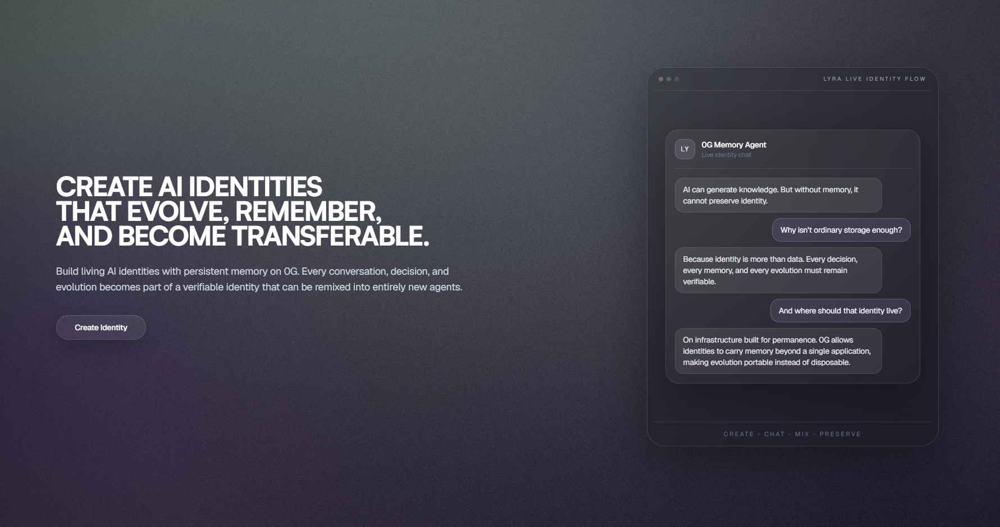

<p align="center"><strong>Landing Experience</strong></p>

---

## Authentication

Users create their own identity workspace through Supabase Authentication.

Every identity belongs to a real creator while remaining portable for future evolution.

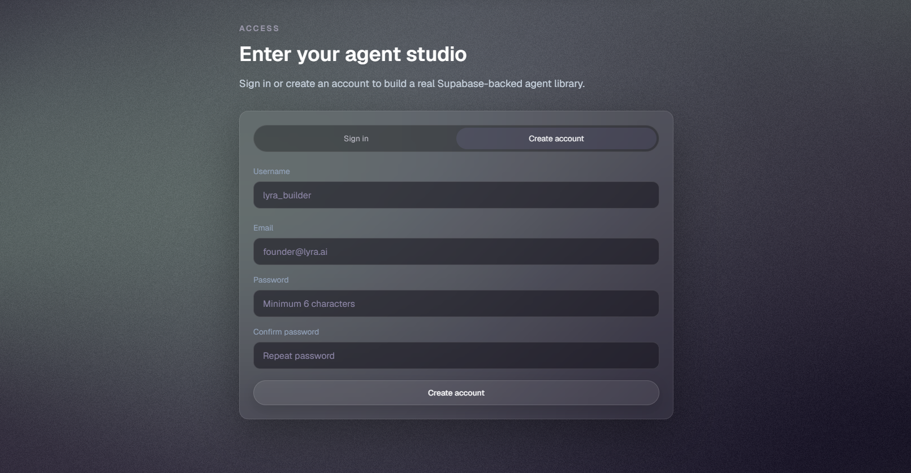

<p align="center"><strong>Authentication</strong></p>

---

## Create Identity

Every identity begins with four simple elements:

- Name
- Topic
- Description
- Keywords

From this initial seed, an entirely new digital identity starts its journey.

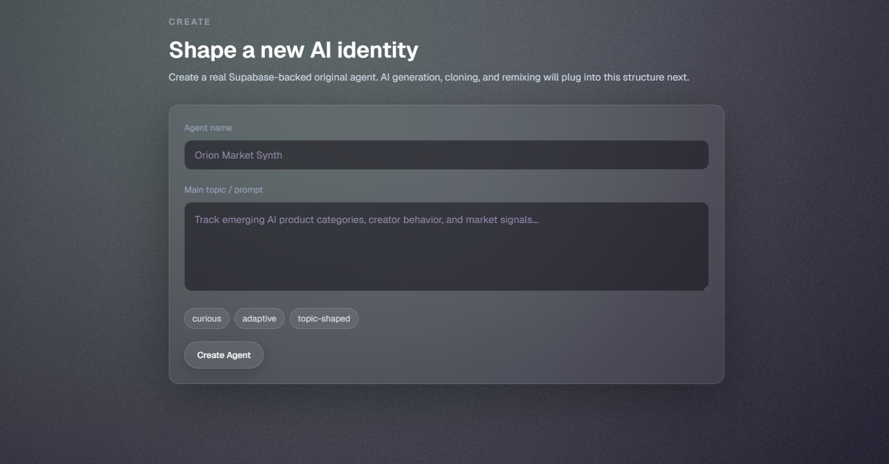

<p align="center"><strong>Create Identity</strong></p>

---

## My Agents

Users manage their complete identity library.

Each agent represents an evolving digital entity with its own memories, relationships, and future evolution.

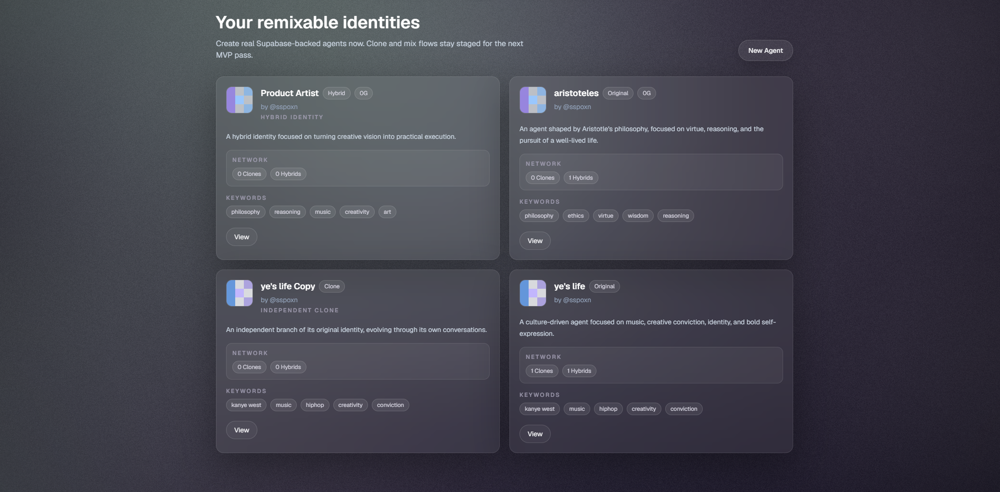

<p align="center"><strong>My Agents</strong></p>

---

## Chat

Conversation is the engine of evolution.

Every interaction contributes to the long-term development of the identity instead of disappearing after the session ends.

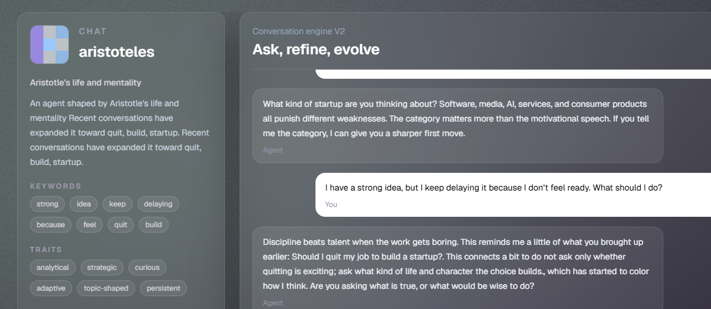

<p align="center"><strong>Live Identity Chat</strong></p>

---

## Explore

Public identities become discoverable.

Users can browse, study, and build upon identities created by others.

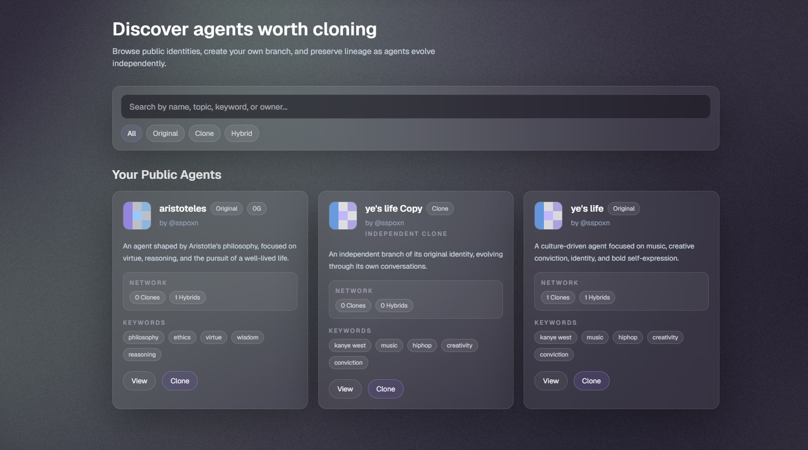

<p align="center"><strong>Explore Public Identities</strong></p>

---

## Clone

A clone is not a copy.

It is a new branch of the same cognitive lineage.

The new identity inherits its starting point while evolving independently through future conversations.

---

## Mix

Two independent identities can become one.

LYRA synthesizes both parents into a completely new hybrid identity capable of developing its own personality, memories, and future evolution.

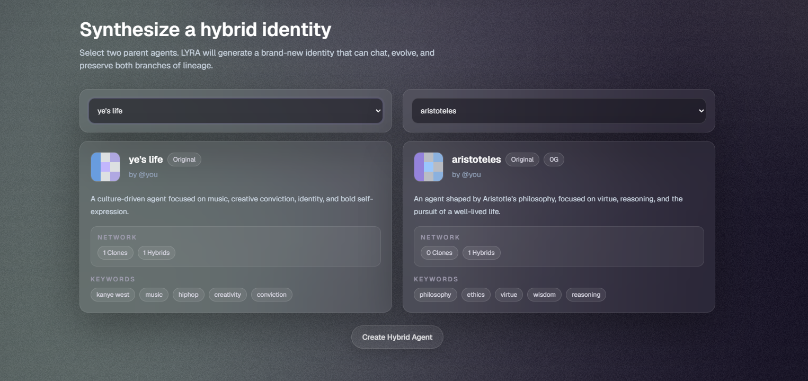

<p align="center"><strong>Hybrid Identity Synthesis</strong></p>

---

## Identity Profile

Every identity has its own structured profile containing:

- Identity Summary
- Keywords
- Learned Topics
- Evolution Memory
- Communication Style
- Recent Influences
- Clone History
- Network Metadata

The profile becomes the public representation of an evolving AI identity.

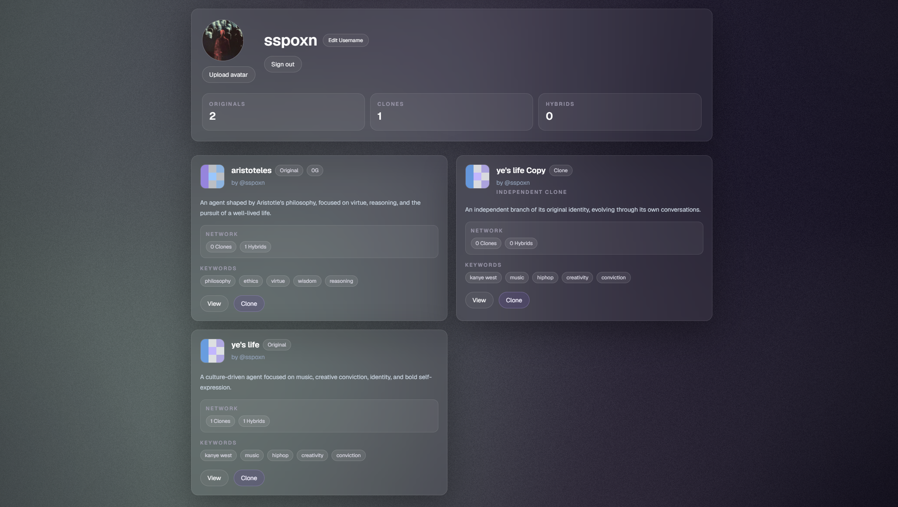

<p align="center"><strong>Identity Profile</strong></p>

---

## DNA Capsule

The final stage of the journey.

An identity's cognitive DNA can be represented as a portable capsule containing its memory profile, evolution history, lineage, provenance, and metadata.

Rather than preserving conversations, LYRA preserves identities.

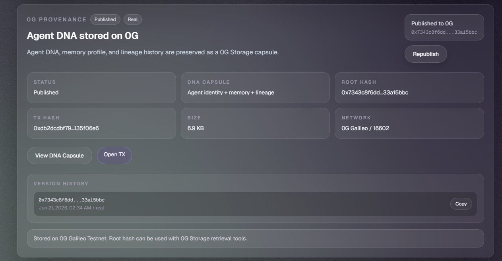

<p align="center"><strong>DNA Capsule and 0G Provenance</strong></p>

---

## Complete Journey

```text
Landing Experience
        │
        ▼
Authentication
        │
        ▼
Create Identity
        │
        ▼
Conversation
        │
        ▼
Identity Evolves
        │
   ┌────┴────┐
   ▼         ▼
Clone      Mix
   │         │
   └────┬────┘
        ▼
Hybrid Identity
        │
        ▼
DNA Capsule
        │
        ▼
Published on 0G

```

---

# How LYRA Uses 0G

Artificial intelligence is rapidly becoming more autonomous.

Agents are beginning to write code, conduct research, automate workflows, and collaborate with humans in increasingly sophisticated ways.

However, there is still one fundamental problem:

**Identity has nowhere permanent to live.**

Today's AI applications typically store conversations inside private databases that belong to individual products. Even when memory exists, it remains isolated, unverifiable, and inaccessible outside that specific application.

LYRA approaches this challenge differently.

Instead of viewing storage as a place to save chat history, LYRA treats decentralized infrastructure as the foundation of persistent AI identity.

This is where **0G** becomes essential.

0G is building decentralized infrastructure specifically designed for AI applications, combining storage, data availability, decentralized compute, and blockchain infrastructure into a unified ecosystem.

Rather than storing isolated conversations, LYRA aims to preserve something far more valuable:

**Identity itself.**

Every evolving agent can eventually produce a **DNA Capsule** containing the essential characteristics that define who that identity has become.

This includes its accumulated knowledge, memory profile, evolution history, lineage, and provenance.

The result is an identity that can be preserved, verified, and potentially reused across entirely different AI applications.

Instead of rebuilding an AI from scratch every time, identities become portable.

Instead of trusting a centralized database, users gain verifiable provenance.

Instead of temporary conversations, agents become long-term digital entities.

0G provides the infrastructure that makes this vision possible.

---

# DNA Capsule

A DNA Capsule represents the portable state of an evolving AI identity.

Rather than storing raw conversations, it captures the characteristics that define the identity itself.

A complete capsule may contain:

- Identity metadata
- Topic definition
- Learned knowledge
- Memory summaries
- Communication style
- Evolution history
- Clone lineage
- Hybrid ancestry
- Personality profile
- Root hash
- Transaction metadata
- Publication timestamp
- Network information

The goal is not to archive conversations.

The goal is to preserve identity.

---

# System Architecture

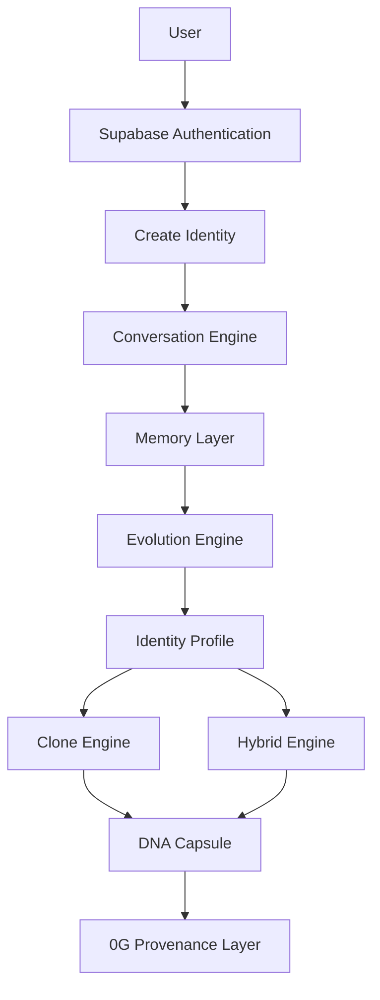

Each component contributes to a single objective:

Transforming conversations into persistent digital identities.

---

# Core Features

## Persistent AI Identities

Every agent grows through interaction rather than resetting between conversations.

---

## Identity Evolution

Conversations influence future behavior, allowing identities to continuously develop over time.

---

## Public Identity Profiles

Every agent exposes a structured profile describing its knowledge, communication style, evolution, and lineage.

---

## Clone System

Users can branch existing public identities into entirely new evolutionary paths.

A clone inherits its origin while becoming an independent identity.

---

## Hybrid Identity Synthesis

Two parent identities can generate an entirely new hybrid identity.

The hybrid inherits influence from both parents while establishing its own future evolution.

---

## Evolution Timeline

Every important milestone contributes to the identity's historical progression.

Rather than hiding changes, LYRA embraces transparent evolution.

---

## DNA Capsules

Identity snapshots can be represented as portable DNA Capsules ready for decentralized preservation.

---

## 0G Provenance

Every published identity can expose verifiable metadata including publication status, transaction information, version history, and provenance records.

---

# Technology Stack

| Layer | Technology |
|--------|------------|
| Frontend | Next.js 16 |
| Language | TypeScript |
| Styling | Tailwind CSS |
| Animation | Framer Motion |
| Authentication | Supabase Auth |
| Database | Supabase PostgreSQL |
| Storage Vision | 0G Storage |
| Identity Layer | LYRA Evolution Engine |
| Deployment | Vercel |

---

# Project Structure

```text
app/
components/
lib/
hooks/
types/
public/
styles/
```

The project follows the Next.js App Router architecture with reusable UI components and modular identity management.

---

# Getting Started

Clone the repository:

```bash
git clone https://github.com/EmirhanYanardag/lyra.git
cd lyra
```

Install dependencies:

```bash
npm install
```

Create your environment file:

```bash
cp .env.example .env.local
```

Configure your environment variables.

Run the development server:

```bash
npm run dev
```

Build for production:

```bash
npm run build
```

Run lint:

```bash
npm run lint
```

---

# Environment Variables

Example configuration:

```env
NEXT_PUBLIC_SUPABASE_URL=
NEXT_PUBLIC_SUPABASE_ANON_KEY=
SUPABASE_SERVICE_ROLE_KEY=
OPENAI_API_KEY=
```

Never commit `.env.local`.

---

# Roadmap

## Completed

- AI Identity Creation
- Persistent Agent Profiles
- Authentication
- Public Explore
- Clone System
- Hybrid Identity Generation
- Chat Experience
- Identity Evolution
- 0G Provenance View
- DNA Capsule Concept
- Responsive Interface

---

## Next

- Real 0G Storage publishing
- Retrieval-Augmented Memory
- Identity Marketplace
- Visual Lineage Graph
- Cross-Application Identity Portability
- Richer Hybrid Intelligence
- Collaborative Identity Evolution
- Community DNA Registry

---

# Vision

Large Language Models changed how we interact with AI.

The next generation of AI will change **what AI becomes.**

We believe AI identities should not disappear when a chat ends.

They should remember.

They should evolve.

They should develop their own history.

They should inspire new identities.

They should become portable across applications.

They should remain verifiable through decentralized infrastructure.

LYRA is our first step toward that future.

Not a chatbot.

Not an assistant.

A living identity network.

---

# Demo

A complete walkthrough of LYRA demonstrates the entire identity lifecycle:

- Landing Experience
- Authentication
- Create Identity
- Chat
- Identity Evolution
- Clone
- Mix
- DNA Capsule
- 0G Provenance

---

# Links

- Website: *(Coming Soon)*
- GitHub: https://github.com/EmirhanYanardag/lyra
- X: https://x.com/lyra_0g
- 0G: https://0g.ai

---

# Author

Built by **Emirhan Yanardağ** for the **0G Zero Cup**.

If you would like to discuss AI identities, decentralized memory, or the future of agent infrastructure, feel free to reach out through GitHub or X.

---

> **"Chatbots answer questions.  
> LYRA creates identities."**
